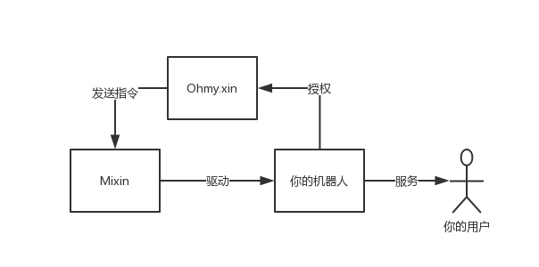
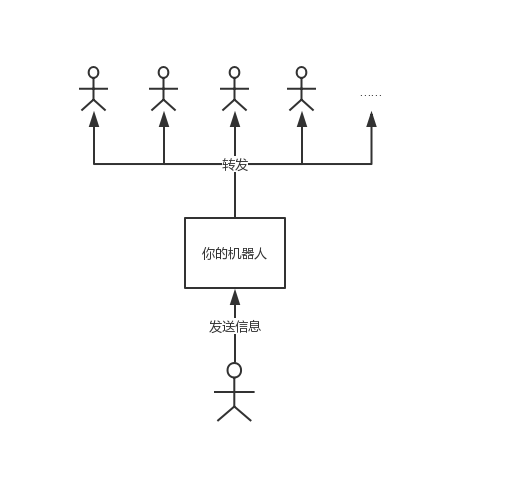

# 介绍

Mixin Messenger 上的机器人有点类似于微信里的小程序。但是相对于微信越来越封闭的生态，Mixin 机器人**足够的开放**，拓展性。只要你会开发和富有想象力，Mixin 机器人可以实现很多非常有意思的功能。

例如 Mixin Messenger 本身的群组最多限制 256 个人，但是通过机器人，可以建立超级大群，不限人数，还可以设置收费进群、持仓限制进群等等。另外，发红包、OTC 交易、直播讲课等等都可以用机器人来实现。

然而，如果你不懂开发，也想要有自己的 Mixin 机器人怎么办？[OhMy.xin](https://ohmy.xin) 可以帮上忙。

**OhMy.xin** 为用户提供托管 Mixin 机器人的 SaaS 服务。目前已上线的机器人品种暂时只有一种，即**社群工具**，**Mixin Circle**，现在大家一般管它叫 Mixin 里的小迷圈。

如果你想免费体验，可以按照以下详细步骤创建。

::: tip
为了得到更好的体验，创建过程请在 PC 端操作。
:::

## 它是如何工作的

要使用 OhMy.xin 的服务，首先你得在 Mixin 注册一个机器人，这个机器人的所有权属于你。

接着将你机器人的必要权限授予给 OhMy.xin，使其具备一定的功能（例如查看机器人信息、接收消息、发送消息等）。

然后，你的机器人就可以服务你的用户了。

它们之间的关系大概是这样的。

以“小迷圈”的广播功能为例，圈主对机器人发送的信息，机器人会自动转发给所有会员，会员发送的信息，也会自动转发给圈主。通过机器人，圈主与会员直接高效沟通。

