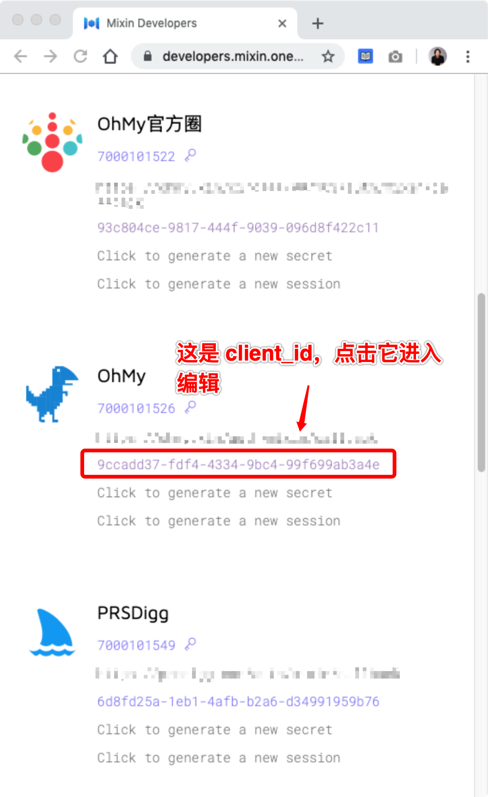
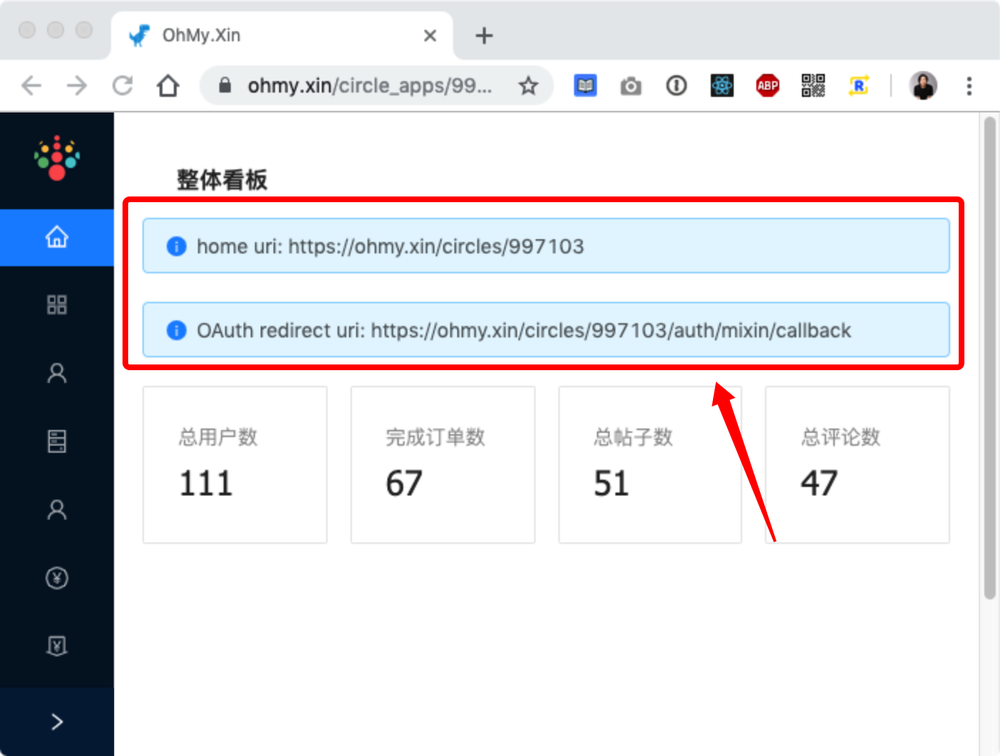
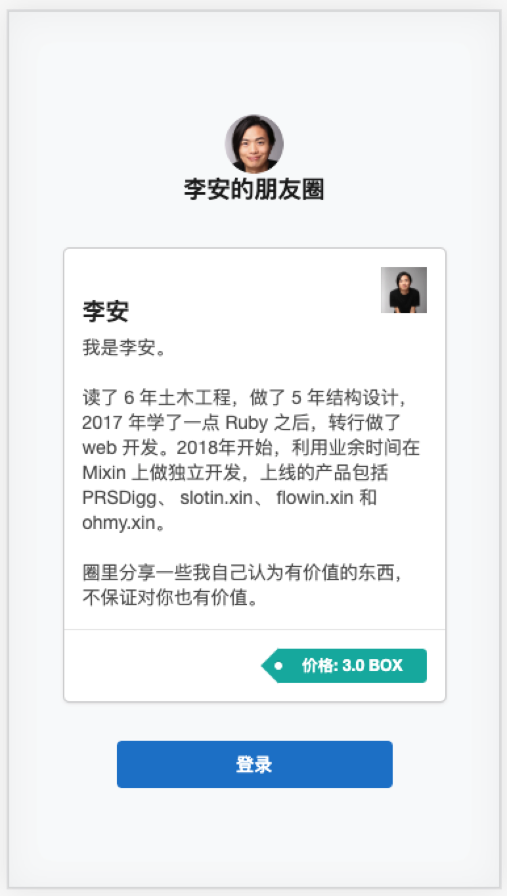

# 配置应用

在 OhMy.xin 中创建成功之后，这个时候在 Mixin Messenger 里打开你的机器人，会发现打开的是你在步骤 [注册机器人](/guide/register-mixin-bot)  中填的 `home uri` 。所以，要把它改过来。

打开 [MIxin 开发者网站的应用列表](https://developers.mixin.one/dashboard)，找到你的机器人，点击 `client_id`，进入编辑状态。

把  `home uri` 和 `OAuth redirect uri` 修改成 OhMy.xin 分配的地址。如果你找不到，可以到 OhMy.xin 的管理后台，首页就能看到。

修改完之后，就可以在 Mixin Messenger 里搜索你机器人的 mixin id，添加为联系人。

一切顺利的话，打开机器人就能看到，你的机器人已经变成一个由 OhMy.xin 提供的社群工具了。

