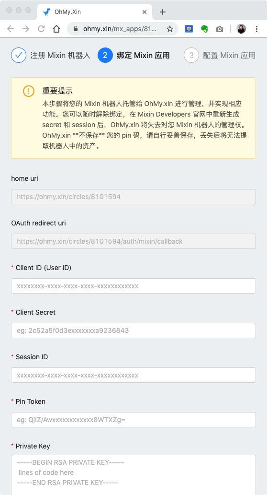
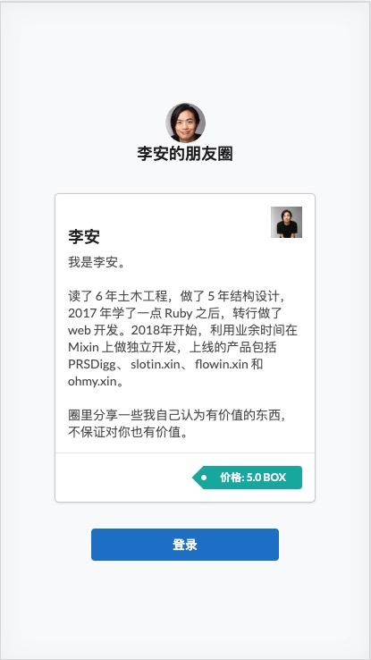

# 托管应用

有了机器人的私钥信息，下一步就是将信息提交给 OhMy.xin，也就是将你的 Mixin 机器人托管给 OhMy.xin 进行管理。

回到 OhMy.xin 的新建页面，点击下一步，进入第二步，如下图所示。

对应着把步骤 [生成机器人私钥](/guide/generate-keys) 得到私钥信息一一填入，点击确认，就可以了。

如果提示失败，请核对一下有没有复制错误。其中私钥要复制完整，包括开始行和结束行。

::: tip 特别提醒
在步骤 [生成机器人私钥](/guide/generate-keys) 里每次点击 `Click to generate a new secret` 和 `Click to generate a new session` 都会生成全新的私钥信息，旧的私钥信息就会立即失效，OhMy.xin 对你机器人的托管也就失效了。
:::

修改完之后，就可以在 Mixin Messenger 里搜索你机器人的 mixin id，添加为联系人。

一切顺利的话，打开机器人就能看到，你的机器人已经变成一个由 OhMy.xin 提供的社群工具了。

