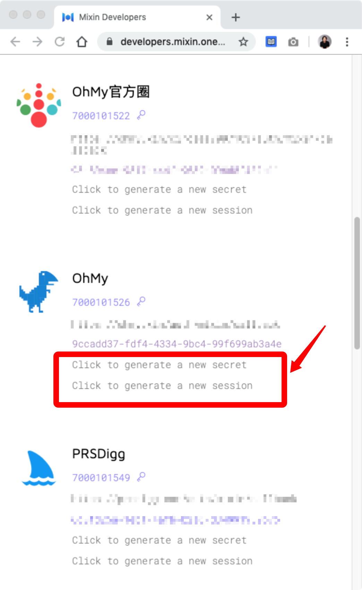

# 生成机器人私钥

创建成功之后，回到应用列表，生成机器人的 `secret` 、`session`、pin 码 和私钥等信息。

点击 `Click to generate a new secret` 和 `Click to generate a new session` ，可以生成机器人的私钥等信息。

各个信息对应的名称如下图，其中 `user id` 对于机器人来说，也叫 `client id`。

这些私钥信息请**务必妥善保管**，有了这些信息，就相当于得到了这个机器人的管理权。

其中 **PIN 码是最最重要的**，是提取机器人中资产的关键密码。没有 PIN 码，即使有其他的私钥信息，也是没办法提取资产的。

OhMy.xin 需要你的机器人的私钥等信息来实现相应的功能，但是**绝对不会保存你的 PIN 码**，换言之，OhMy.xin 是无法私自提取你的机器人中的资产的。

::: danger
请务必小心保管好你的机器人 PIN 码，丢失之后，谁也提取不了机器人中的资产了，包括你自己。
:::
