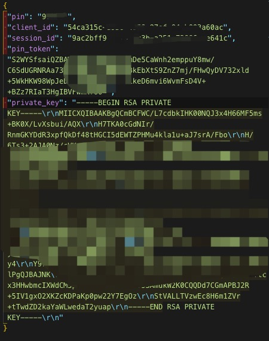
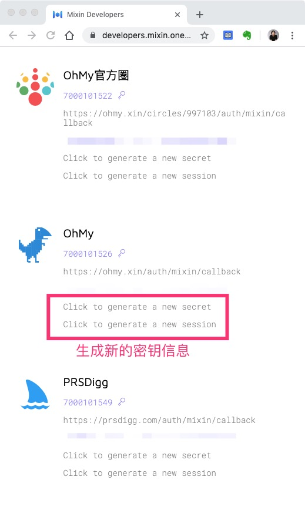

# 生成机器人私钥

创建成功之后，回到应用列表，生成机器人的 `secret` 、`session`、pin 码 和私钥等信息。

点击 `Click to generate a new secret`，会得到一个格式为 `xxxxxxxx-xxxx-xxxx-xxxx-xxxxxxxxxxxx` 的字符串，这就是你机器人的 `client_secret`。

点击 `Click to generate a new session` ，会下载一个名为 `keystore.json` 的文件。下载后，用记事本等编辑器打开，会得到你机器人的其他密钥信息，包括

- `pin`
- `client_id`
- `session_id`
- `pin_token`
- `private_key`

拥有以上所有的密钥信息，就得到了这个机器人的所有权限。因此，`keystore.json` 文件请善保管，如果怀疑泄露或者丢失，请立即重新生成，旧的密钥信息就会马上失效。

有了这些信息，就相当于得到了这个机器人的管理权。

其中 **PIN 码是最最重要的**，是提取机器人中资产的关键密码。没有 PIN 码，即使有其他的私钥信息，也是没办法提取资产的。

OhMy.xin 需要你的机器人的私钥等信息来实现相应的功能，但是**绝对不会保存你的 PIN 码**，换言之，OhMy.xin 是无法私自提取你的机器人中的资产的。

::: danger 谨记
请务必小心保管好你的机器人 PIN 码，丢失之后，谁也提取不了机器人中的资产了，包括你自己。
:::
