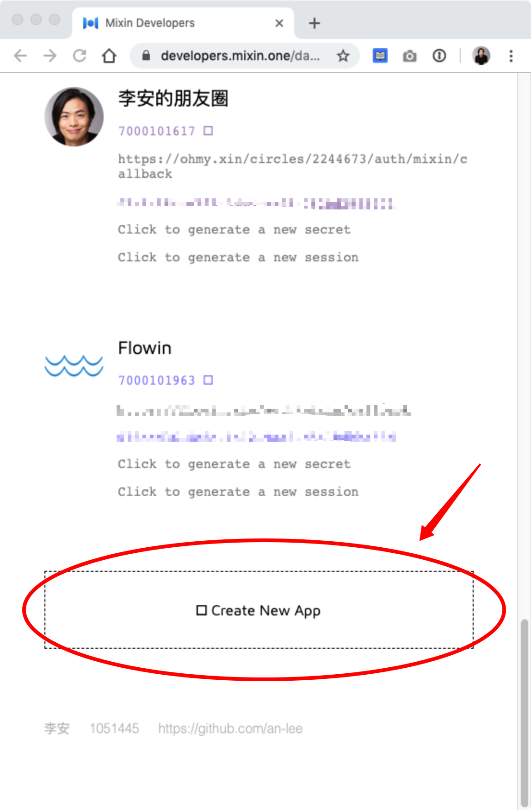
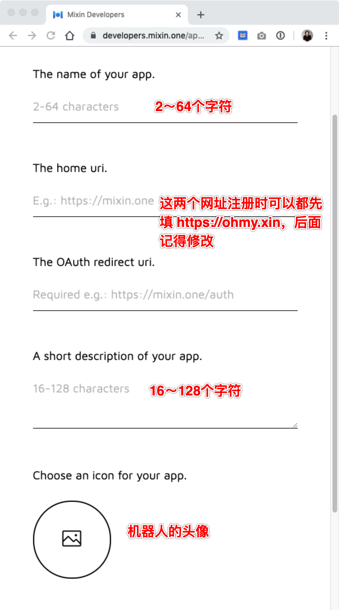

# 注册 Mixin 机器人

首先要厘清一个概念，**Mixin 机器人**是在 Mixin 注册的，提供方是 Mixin。而**社群工具**，即 **Mixin Circle**是 OhMy 提供的机器人服务，其载体则是 **Mixin 机器人**。

要用 OhMy 提供的服务，第一步就是要先注册自己的 Mixin 机器人。注册地址是 Mixin 的开发者网站 [https://developers.mixin.one](https://developers.mixin.one) 。

## 注册机器人

同样建议在 PC 端打开以上网站，Mixin 扫码授权之后，就可以进入了。点击底部的 `Creat New App` 按钮开始创建。

按照提示，填入各项就行。

**注意**，如果提交的时候提示 `Invalid data submitted`，多数是因为名称或者简介的字数不符合要求，重新检查一下。

其中 `home uri` 是打开机器人出现的主页，`OAuth redirect uri` 是机器人授权成功之后跳转的地址，注册时可以先随便填一个网址（比如 `https://ohmy.xin`）。**要记得在托管应用后，需要再修改为 OhMy.xin 分配的地址**。
