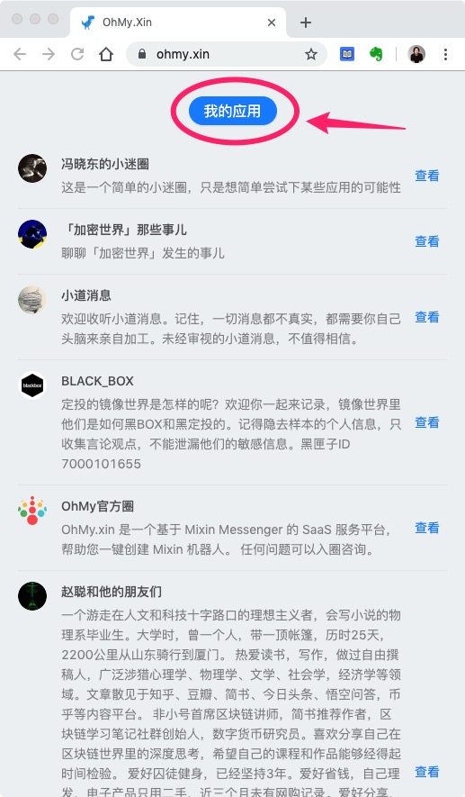
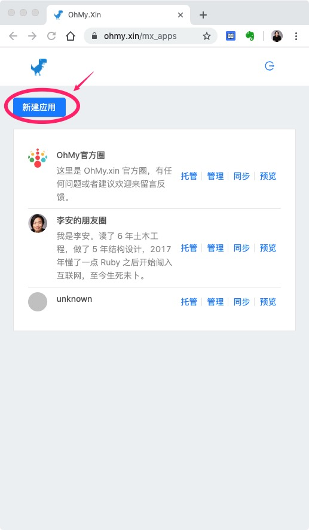
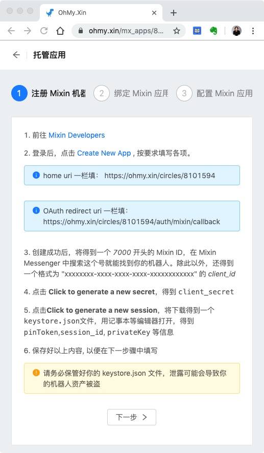

# 注册 OhMy

打开 [https://ohmy.xin](https://ohmy.xin)，点击登录按钮。

如果你是在 PC 端，会跳转到一个 Mixin 二维码，请用 Mixin Messenger 扫码，同意授权后，即可登录成功。

登录成功之后，原来登录按钮会变成 `我的应用`。

点击它进入我的应用列表，然后点击 `新建应用`。

新建应用分为三步，分别是

- 注册 Mixin 机器人
- 绑定 Mixin 应用
- 配置 Mixin 应用

咱们一步一步说。
